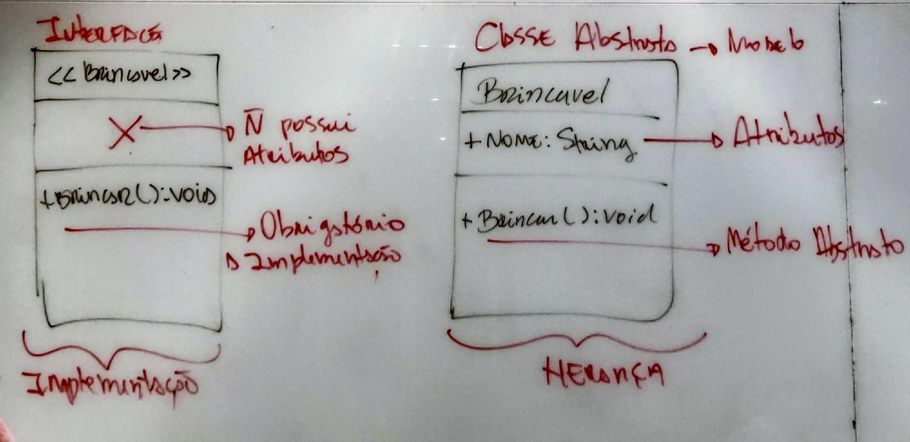

# Classe abstrata e Heranças

## Heranças
- não dá para herdar de mais de uma classe (extends Pessoa extends Crianca) - a interface pode

### Subclasses
É uma classe dentro da outra.

### Visibilidade

#protegido é muito utilizado em caso de herança

**Sobrescrita (Overriding)** de método não muda a assinatura do método, só a implementação lógica
Usado em casos de interface, classe abstrata e herança, em casos de polimorfismo

**Sobrecarga (Overloading)** de método define um mesmo método, mas com parâmetros diferentes
Ele leva em consideração o tipo dos parâmetros

**Super** serve para as classes filhas fazerem referência à construtores, atributos e métodos da classe pai
Ela não altera nada
Sempre que eu preciso pegar algo do pai, principalmente quando é protected.

```
public Cachorro(String nomeDoAnimal){
    super(nomeDoAnimal);
}
```

## Classe abstrata
- Não podem realizar nenhum tipo de instância (ter objetos)
- Serve de modelo para criar classes concretas derivadas

```
public abstract class Animal {
```

### Métodos abstratos

- Possuem métodos abstratos, que as filhas devem sobrescrever(override)
- A implementação lógica de um método abstrato nas filhas não precisa necessariamente mudar a implementação lógica
- Classes abstratas podem herdar de classes abstratas, e os filhos precisam herdar os métodos abstratos conforme a árvore genealógica.

**Classe abstrata**
```
public abstract class Animal{
    public abstract void racaAnimal(String raca);
```

- Pode ter construtor na classe abstrata, mas não pode instanciar diretamente ela, você pode sobrescrever o construtor em uma classe filha, e depois instanciar o construtor filho

**Classe derivada**


## Interface
- Relacionamento: implementação
- cria um contrato e, a classe que implementa precisa sobrescrever todos os métodos.
- sem atributos
- os métodos de uma interface não tem implementação lógica, precisa ser sobrescrito
- intermedia a comunicação

**Quando usar**
- é melhor que tenha várias interfaces com um único método
- é utilizado quando uma classe precisa de dois "pais". Não dá pra ser uma classe abstrata porque seria herança múltipla, então se cria uma interface para isso
- é uma alternativa para classe abstrata no caso de métodos que não seriam aplicados para todos os filhos de uma classe abstrata.

Interface

```
public interface Saudavel{
    public boolean animalSaudavel(String diagnostico);
}
```

Classe implementando Interface

```
//implementar de mais de uma interface - implements Saudavel, Gorduroso...
// pode ser combinado com extends (vem primeiro) e com abstract class

public class Cachorro implements Saudavel{ 
    @Override
    public boolean animalSaudavel(String diagnostico){
        return false;
    }
}
```

- **Se uma classe abstrata implementa uma interface, ela não tem obrigação de pegar o método, mas as filhas sim.**




